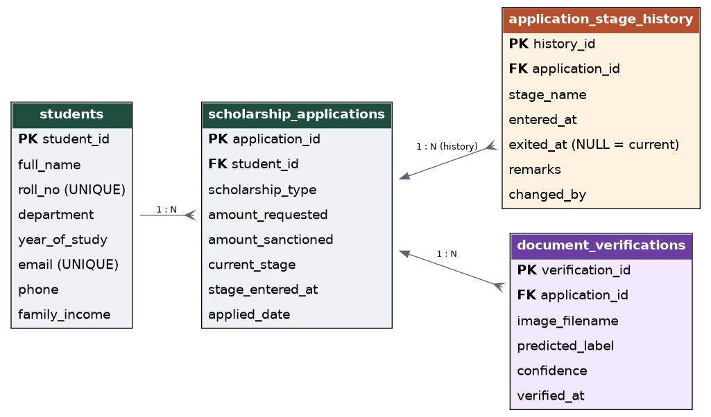

# ER Diagram - Student Scholarship Application and Disbursement Tracker

## Entities

| Entity | Primary Key | Foreign Key(s) |
|---|---|---|
| `students` | `student_id` | - |
| `scholarship_applications` | `application_id` | `student_id` -> students |
| `application_stage_history` | `history_id` | `application_id` -> scholarship_applications |
| `document_verifications` | `verification_id` | `application_id` -> scholarship_applications |

## Design decision (justification)

The single decision that matters most here is keeping `application_stage_history`
as its own append-only table instead of just overwriting a `current_stage`
column on `scholarship_applications`.

A `current_stage` column can only ever answer "where is this application
right now?" The moment a clerk moves an application from "Document
Verification" to "Section Review", the fact that it spent 41 days stuck in
"Document Verification" is gone forever if that's the only place the stage
was recorded. That is exactly the problem this tracker exists to fix - "a
student asking where their application has reached cannot be told, and
applications stall at a stage for months without anyone noticing."

By writing one row per stage transition (`entered_at`, `exited_at`,
`changed_by`, `remarks`) and never updating or deleting old rows, the same
data now answers three different questions the section actually needs:
how long an application sat at each stage, whether it bounced back to an
earlier stage more than once, and who moved it and when. `current_stage` on
`scholarship_applications` is kept too, purely as a fast-read cache for the
listing screen, so we don't have to compute "latest row" for every single
list view - but the history table is the source of truth.

`document_verifications` is deliberately its own table rather than columns
bolted onto `scholarship_applications`, because an application can have more
than one document uploaded/re-uploaded, and each attempt (with its own model
confidence score) needs to be kept, not overwritten.
